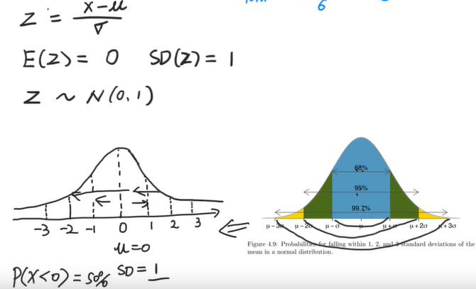

<!-- TOC -->

- [Learning Notes of Statistics](#learning-notes-of-statistics)
  - [00 Central Limit Theorem](#00-central-limit-theorem)
  - [01 Normal Distribution](#01-normal-distribution)
  - [02 Binomial Distribution](#02-binomial-distribution)
  - [03 Poisson & Index Distribution](#03-poisson--index-distribution)

<!-- /TOC -->

# Learning Notes of Statistics

## 00 Central Limit Theorem
- 
- 中心极限定理是概率论中的一组重要定理，它的中心思想是**无论是什么分布的数据**，当我们从中抽取相互独立的随机样本，且采集的样本足够多时，**样本均值**的**分布**(中心、分散度、形状)将**收敛于正态分布**。当采样的数量接近无穷大时，我们的抽样分布就会近似于正态分布。**这个统计学基础理论意味着我们能根据个体样本推断所有样本**。结合正态分布的其他知识，我们可以轻松计算出给定平均值的值的概率。同样的，我们也可以根据观察到的样本均值估计总体均值的概率。
- 
- 

## 01 Normal Distribution
- 正态分布中的标准差有两个含义：1.确定正态分布的形状；2.数据离均值的平均距离
- 
- 
- 

## 02 Binomial Distribution
- 伯努利事件条件：1.只有两个结果；2.可以重复多次；3.每次事件相互独立
- 
- 

## 03 Poisson & Index Distribution
- Poisson分布：离散型分布，描述**一段时间内**（单位时间内），事件发生**多少次**的概率分布。**发生次数角度**。*期望是单位时间内时间发生的次数。*
- Index分布：连续型分布，描述事件与事件之间的**时间间隔**的概率分布。**时间间隔角度**。*期望是相邻两个时间发生的时间间隔。*
- *两者只有在相同单位时间跨度内，lambda的值相同，且期望互为倒数*。
- 